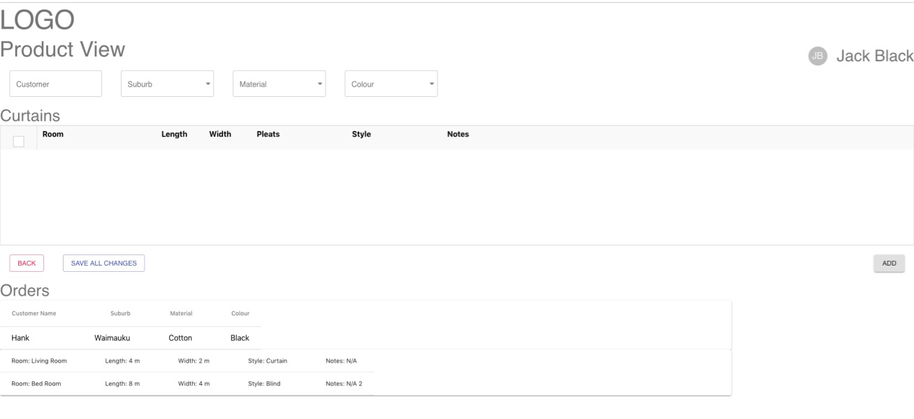
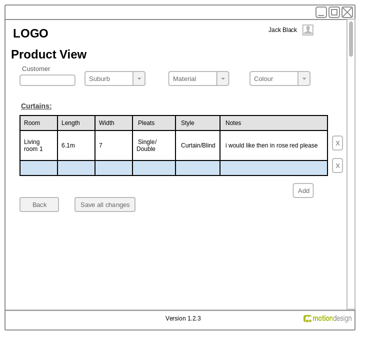

## About 

This is a test designed by Motion Design. To test the candidates have sufficient knowledge of front-end.

## Get Started

### server setup
*npm run server has been written in package.json*
1. npm run server or java -jar server-1.0.3.jar
2. (optional)go to http://localhost:8181/openapi.json

### npm start

1. Runs the app in the development mode
2. Open [http://localhost:3000](http://localhost:3000) to view it in the browser

### npm run build

1. Builds the app for production to the `build` folder
2. It correctly bundles React in production mode and optimizes the build for the best performance

*See the section about [deployment](https://facebook.github.io/create-react-app/docs/deployment) for more information.*

### User Acceptance criteria:
1. The table should support backward and forwards navigation using tabs

Done. By implementing React Data Grid, users many navigate the form with arrow keys and tab

2. Pressing tab from the last cell in the table should create a new row

To be discussed.

React Data Grid could use arrow keys, tab and enter to navigation

In React Data Grid, I couldn't fetch **Tab** in the table built by React Data Data, so I wasn't able to use **Tab** to create a new row

But I can build a table by myself, or use nother third package, such as React Bootstrap Table

For this task, I think this package might provide a better user experience

3. You must load and display the suburbs, material, and colours from the given server

Done. Applying **fetch** function, to  get data from back-end

4. There must be a functional save button

Done. By clicking the **Save ALL CHANGES** users may send the data to the server

5. Saved data must be restored on refresh or page load

Done. The page will get the data after refreshing the page automatically by clicking the **Save ALL CHANGES**

## Wireframe

## Reference
1. [Motion Design](https://motiondesign.nz/)
2. [Material Design](https://material-ui.com/)
3. [React Data Grid](https://adazzle.github.io/react-data-grid/)
4. [Swagger](https://editor.swagger.io/)
5. [React Bootstrap Table](http://allenfang.github.io/react-bootstrap-table/index.html)